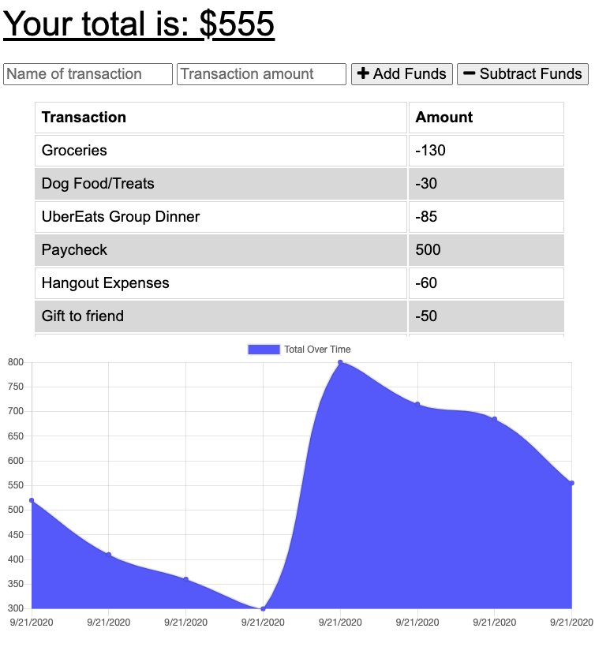

# Budget Tracker

## Description

An application that lets the user add expenses and deposits to their budget online and offline. Transactions entered offline will populate the total when brought back online.

## Table of Contents

* [Installation](#Installation)
* [Usage](#Usage)
* [Questions](#Questions)
* [License](#License)

## Installation

Run 'npm install' to download the following packages: express, mongoose, morgan, compression.

## Usage

Run 'npm start' in the terminal and go to localhost:3000

or go to the Heroku link here: <https://shielded-fortress-42520.herokuapp.com/>

## Questions

* Github: <https://github.com/andrewyen64>

* Email: andrewyen64@gmail.com

## License

GNU_v3.0 License

Copyright © 2020 Andrew Yen

[Link to License](LICENSE)
